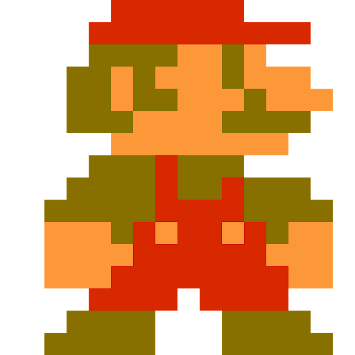

# CPS 499, Spring '21 - Game Development 
## Project 1 - Cocos2D game
#### Created by: Jacob Scheetz

## Description

This is a simple python game developed with cocos2d. The objective of this game is to move the sprite to the objective three separate times to win the game. This idea was inspired by the common "platformer" stlye of game. This game uses different classes to demonstrate encapsulation and inheritance in an object oriented format following game logic. 

## How To Play (Controls)
**the arrow keys are used for 4 directional movement**
- "up" arrow key moves the character up along the y axis 
- "down" arrow key moves the character down along the y axis
- "left" arrow key moves the character left along the x axis
- "right" arrow key moves the character right along the x axis

**space bar is used to change levels upon objective completion**
- "space" is used to change to the next level once the player reaches the target for the current level

#### Helpful Tip
- by continously hitting the arrow keys, you will get a smoother movement of the character!

## Resources 

The following resources were used to get a good foundation of how cocos2d is structured, how functions are used properly and to troubleshoot my own code:
- https://github.com/liamrahav/cocos2d-python-tutorials
- http://python.cocos2d.org/doc.html
- http://python.cocos2d.org/doc/api/cocos.html

